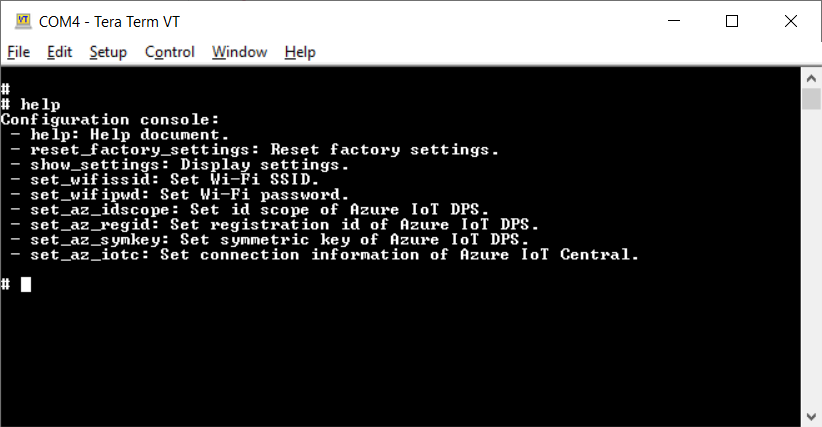
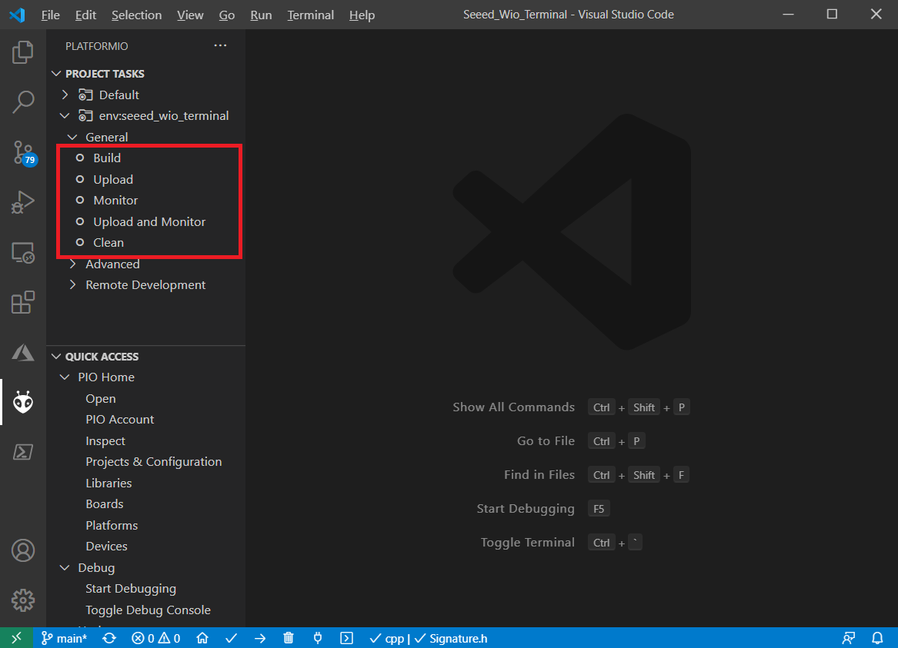

# Seeed Wio Terminal

Based on Wio Terminal Azure IoT sample code by Seeed Corporation

<https://github.com/SeeedJP/wioterminal-aziot-example> 

## Modifications

- Displays wallpaper
- Additional compile flag to disable/enable IoT Plug and Play
- Precompiled UF2 files in `bin` folder

## Instruction

1. Connect Wio Terminal to PC with USB Type C cable
1. Boot Wio Terminal in the `bootloader` mode by sliding the power switch twice quickly
1. An external drive named Arduino should appear in your PC
1. Copy uf2 file from `bin` folder to the external drive
1. Start a terminal software such as Putty or Teraterm
1. Hold 3 buttons and reboot Wio Terminal to enter `configuration` mode
1. Open Serial Port in the terminal software with following settings  

    

1. Configure WiFi access point and device authentication method for Device Provisioning Service (DPS) or IoT Central in CLI mode  

    

## Build from source code

1. Install [Visual Studio Code](https://aka.ms/vscode)
1. Install [PlatformIO extension](https://marketplace.visualstudio.com/items?itemName=platformio.platformio-ide)
1. Open `Seeed_Wio_Terminal` folder with Visual Studio Code
1. In PlatformIO extension menu, select `build`
1. Select Upload to use compiled firmware

