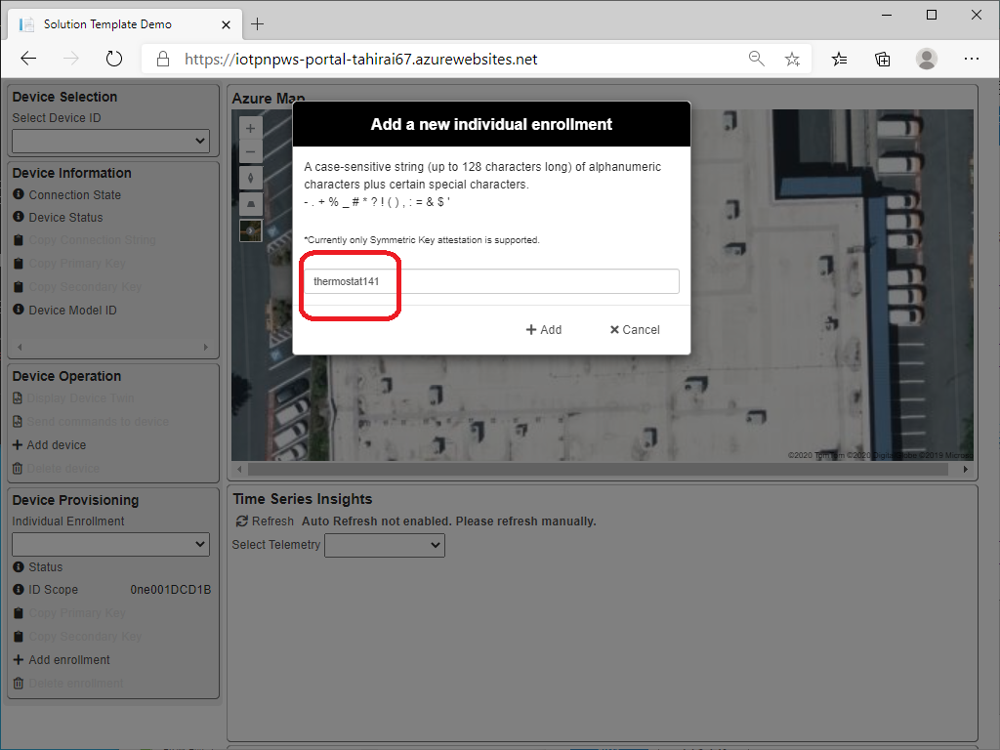
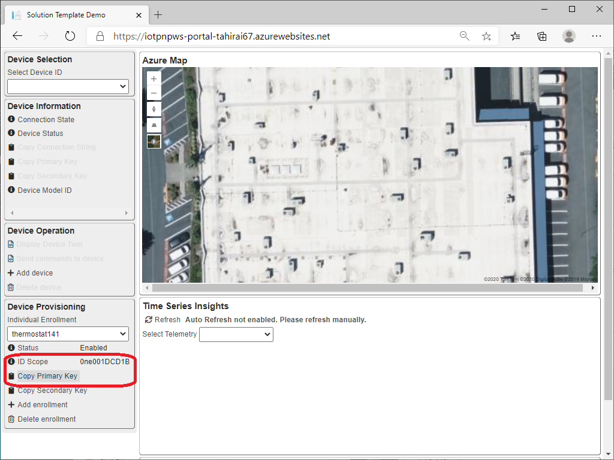
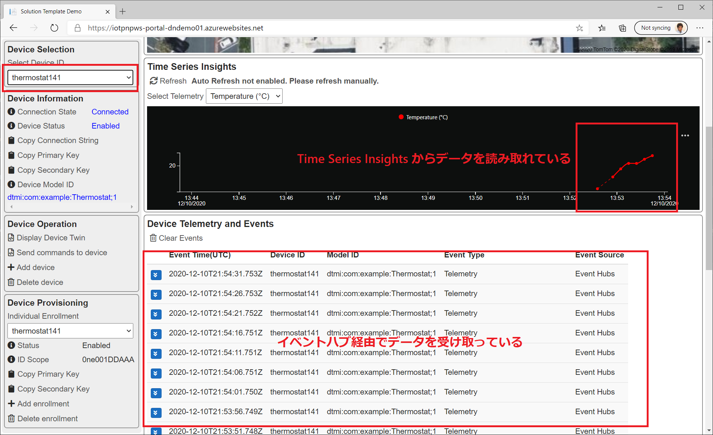
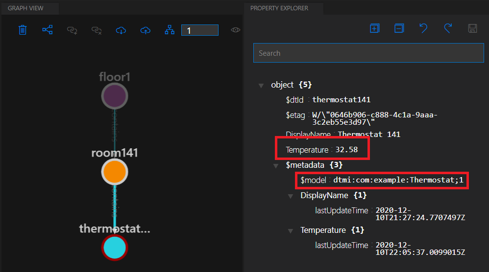
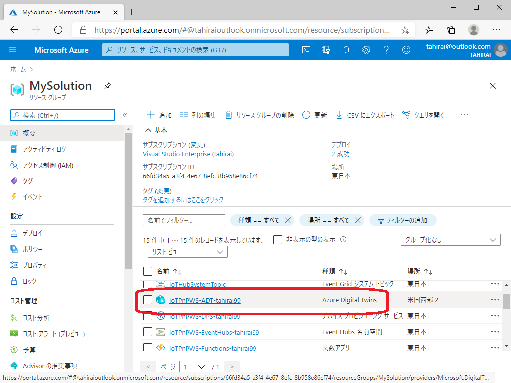
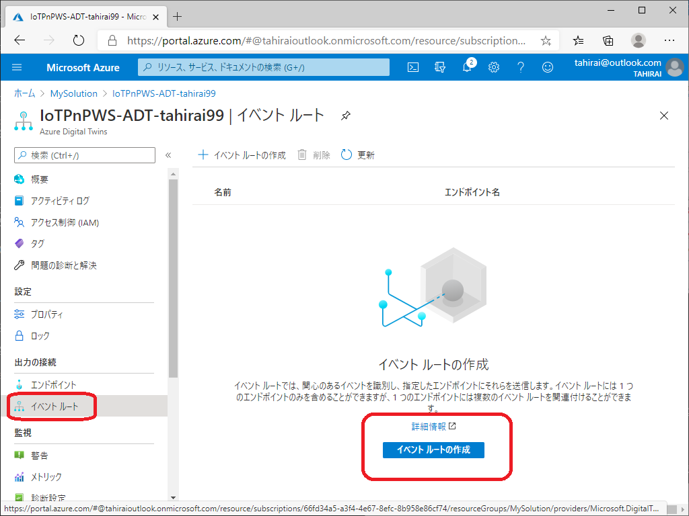
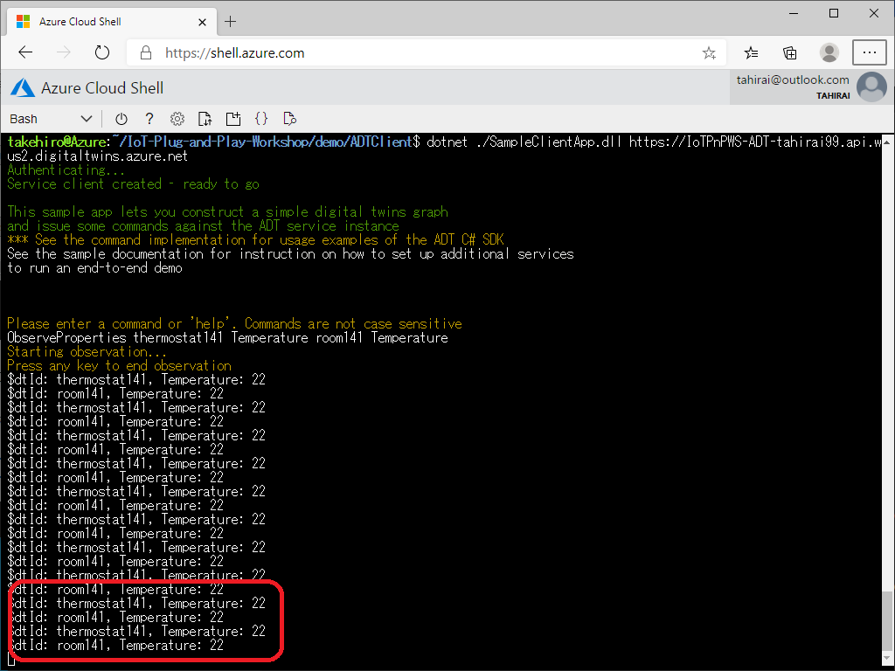

# 実践編 : ADT シナリオの確認  

このページでは、PaaS で体験 (応用編) ハンズオンをご説明します  
様々な画面を切り替えながらの作業になります、ご注意ください  

## ステップ 1. 温度計シミュレーターの接続  

IoT Plug and Play デバイスとして動作する温度計シミュレーターをソリューションに追加します

`WSL` の環境で、シミュレーションデバイスをソリューションにプロビジョニングし、データを送信します

> [!TIP]  
> シミュレーターは Ubuntu, Raspbian, WSL での動作確認済みです

1. WSL を起動し、シェルにアクセスします

1. シミュレーターをクローンします

    ```bash
    cd ~
    git clone https://github.com/microsoft/IoT-Plug-and-Play-Workshop.git
    cd ~/IoT-Plug-and-Play-Workshop/demo/SimpleThermostat/script
    ```

1. 実行用シェルスクリプトを任意のテキストエディタで開きます  

    例：

    ```bash
    nano run.sh  
    ```

1. ブラウザーでサンプルソリューションへアクセスします

1. 画面左下の `Add enrollment` をクリックします  

      

1. `thermostat141` と入力して Add をクリックします  

    > [!NOTE]  
    > 今回はこのデバイス名であることが必須になりますのでご注意ください  

      

1. Copy Primary Key をクリックします  

      

    > [!TIP]
    > ID Scope はコピーボタンがありませんので、選択し、コピーするか、手入力をしてください

1. 上記で作成したエンロールメントから、 DPS ID Scope、Device ID、対称鍵を入力して保存します  

    ```bash
    # export DPS_X509=1
    # Set ID Scope for DPS
    # E.g. export DPS_IDSCOPE='0ne12345678'
    export DPS_IDSCOPE='ソリューションからコピーした ID Scope の値' 
    
    # for Symmetric Key Provisioning
    # Get Device ID and Symmetric Key from the certification portal
    export DPS_DEVICE_ID='thermostat141'
    export DPS_SYMMETRIC_KEY='ソリューションからコピーした Primary Key の値'
    ```  

1. 変更を保存し、スクリプトを実行します

    ```bash
    ./run.sh  
    ```  

1. デバイスがソリューションにプロビジョニングされ、データが送信されていることを確認します

    実行例 : プロビジョニングされ、IoT Hub がメッセージを受け取っていることが確認できます

    ```bash
    wcbiot@Ubuntu18-NUC:~/IoT-Plug-and-Play-Workshop/demo/SimpleThermostat/script$ ./run.sh 
    Starting Simple Thermostat IoT Hub Device App
    Info: IoTHubInitialize()
    ==================================================
    Start device provisioning with symmetric key
    ==================================================
    Info: Provisioning Data
    ID Scope   : 0ne001DDAAA
    Device ID  : thermostat141
    Device Key : ehpkpq/DtSqWz/xcci50Tevp/X374/9XCdXaj6P761ouwnIyVlVzemv/flIrqWM+dfdfdfdfadf==
    Model ID   : dtmi:com:example:Thermostat;1
    Info: Provisioning Status: PROV_DEVICE_REG_STATUS_CONNECTED
    Info: Provisioning Status: PROV_DEVICE_REG_STATUS_ASSIGNING
    Info: Registration Information received from DPS
    Info: IoT Hub     : IoTPnPWS-Hub-dndemo01.azure-devices.net
    Info: Device Id   : thermostat141
    Provisioning completed
    Info: IoTHubDeviceClient_LL_CreateFromDeviceAuth Success
    Info: Connected to iothub : IoTPnPWS-Hub-dndemo01.azure-devices.net
    Info: IoTHubClient_LL_SendEventAsync accepted message for transmission to IoT Hub
    Info: IoTHubClient_LL_SendEventAsync accepted message for transmission to IoT Hub
    
    ```

    ソリューション側ではデータを受け取っていることが確認できます

    

## ステップ 2. ADT Twin 状況を監視

準備編で `ADTClient` を起動させた `クラウドシェル` の画面を開きます

> [!TIP]  
> クラウドシェルは 20 分間操作しないとタイムアウトしますので、ご注意ください。
> タイムアウトしてしまった場合には再接続し、ADT Client を再度起動してください。
>
> ```bash
> cd  IoT-Plug-and-Play-Workshop/demo/ADTClient  
> dotnet ./SampleClientApp.dll (_ADT_Host_Name)  
> ```

以下のコマンドを入力して、ツインノードの `Temperature` プロパティーを定期的にモニターします

```bash
ObserveProperties thermostat141 Temperature room141 Temperature
```

  

画面が続々と流れていきます  

  

Azure Functions アプリケーションですでにデバイスのデータをツインのノードに転送する処理が実装済みですので、`thermostat141` にはデバイスが送信する温度データがリアルタイムに反映されています。

ところが、温度データは `room141` には反映されていません。

また、ADT Explorer で `theremostat141` を選択すると、IoT Plug and Play の Model ID `dtmi:com:example:Thermostat;1` の `Temperature` プロパティーが更新されているのが確認できます。

  

## ステップ 3. Digital Twin Update イベントの Pub-Sub を設定

Event Grid を使用して、Azure Digital Twins からイベントを Azure Functions に送信します

今回も ARM Template を使用してソリューションに設定を追加します

以下の **Deploy to Azure** ボタンをクリックします  

<a href="https://portal.azure.com/#create/Microsoft.Template/uri/https%3A%2F%2Fraw.githubusercontent.com%2Fmicrosoft%2FIoT-Plug-and-Play-Workshop%2Fmain%2FDeployment%2FCreateADTEventGrid.json" target="_blank"></a>  

> [!TIPS]  
> (この文章を参照し続けるため) ボタンを右クリックして **リンクを新しいタブで開く** または **リンクを新しいウィンドウで開く** とするのを推奨します  

`リソースグループ` と `Unique ID` がサンプル IoT ソリューションデプロイ時と同じものになっているかどうかを必ず確認してください (違うものを指定するとエラーになります)  

  

`確認および作成` をクリックします  
検証に成功したのを確認したら、`作成` をクリックします  
デプロイが完了したのを確認します  

> [!TIPS]  
> 今回のデプロイは1分前後で終了します

  

## ステップ 4. ADT にイベントルート追加  

ARM Template でイベントの Subscribe の準備ができました。  
`Azure Portal` にて Azure Digital Twins がイベントを**パブリッシュ**するよう設定します。

1. サンプル IoT ソリューション のリソースグループに移動します  
1. Azure Digital Twins を選択します

      

1. 左メニューの `イベントルート` から、`イベント ルートの作成` をクリックします

      

1. 以下の画面のように記入します  

    |フィールド  |説明  |例  |
    |---------|---------|---------|
    |名前     | 任意のイベントルート名        | ADTRoute        |
    |エンドポイント     |  ADTEventGridEP | ARM テンプレートで設定済みなのでこの値を使います       |
    |イベントの種類     | ツインの更新        |今回はツインの更新のみ通知します         |

      

## ステップ 5. プロパティー更新の確認

`ADTClient` の画面に戻ります。  
イベントルートが有効になり初期化が完了すると、Room 141 に温度が反映されるようになったのを確認出来ます。

> [!TIP]  
> 初期化には 1 分程度かかります

    

ここで `ADT Explorer` も見てみてください
こちらも温度が反映されているのを確認出来ます  

  

## ステップ 6. Azure Map との連動を確認

WEB ブラウザの `サンプル IoT ソリューション` の画面に戻ります  
画面上のインドアマップ、特に Room 141 にご注目ください...  

  

何かが起きるのを確認されましたら、実践編の作業は完了です  

[ワークショップ トップページに戻ります](../)  

***