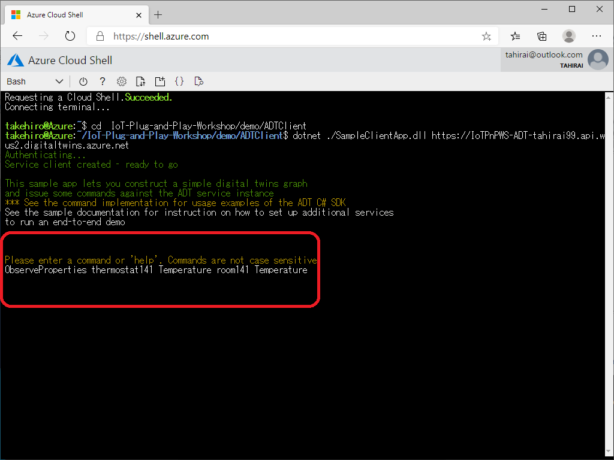
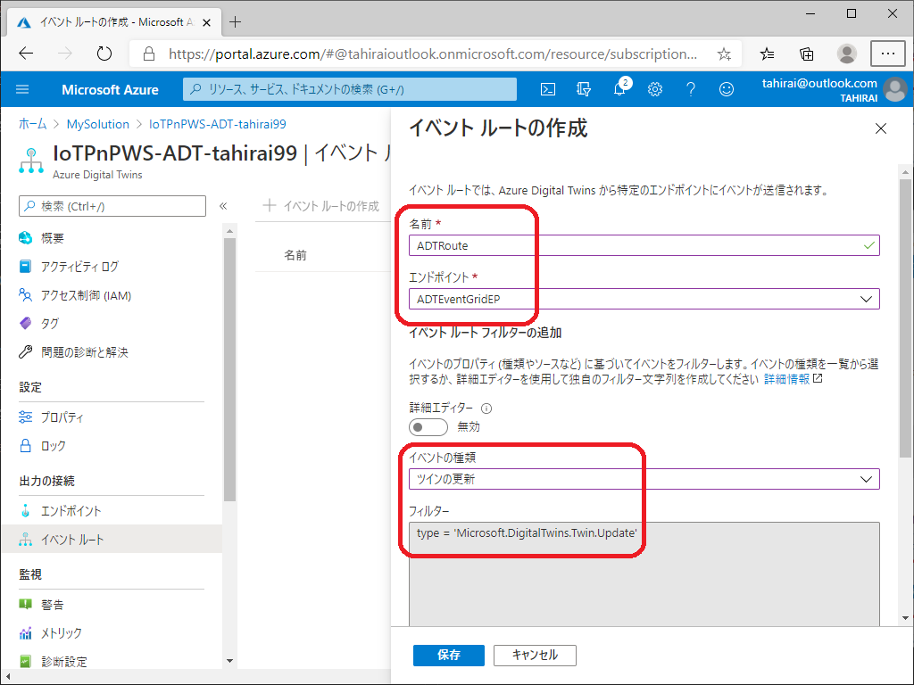
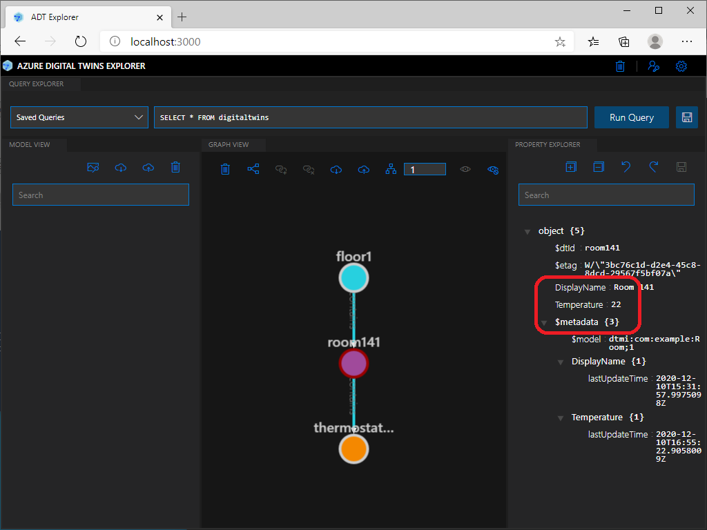
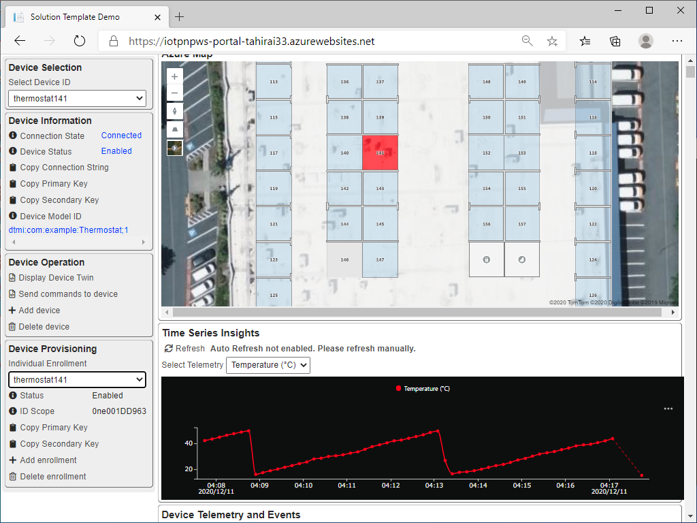

# 実践編 : ADT シナリオの確認  

このページでは、PaaS で体験 (応用編) ハンズオンをご説明します  
様々な画面を切り替えながらの作業になります、ご注意ください  

## ステップ 1. 温度計シミュレーターの接続  

  最初は WEB ブラウザの `サンプル IoT ソリューション` での作業になります

1. 画面左下の add enrollement をクリックします  

      

1. `thermostat141` と入力して Add をクリックします  
    > [!NOTE]  
    > 今回はこの文字列であることが必須になりますのでご注意ください  

      

1. ID Scope をコピーし、Copy Primary Key をクリックします  

      

  ここからは PC の `WSL` の環境での作業になります  

1. 実行用シェルスクリプトを任意のテキストエディタで開きます  

    ```bash
    nano run.sh  
    ```
1. DPS Scope ID、Device ID、対称鍵を入力して保存します  

    ```bash
    # export DPS_X509=1
    unset DPS_X509
    export DPS_IDSCOPE='0ne001DCD1B'
    export DPS_DEVICE_ID='thermostat141'
    export DPS_SYMMETRIC_KEY='JAur2CwjpAEh396Y/FR2Td2jd93/VeYIXf9C02idoLOVENsgWye6tdEaKucILmzppGp8dtr42v934hjlm6rSQQ=='
    ```  
1. スクリプトを実行します
    ```bash
    ./run.sh  
    ```  

## ステップ 2. ADT Twin 状況を監視
準備編で起動させたままにしている、`ADTClient` の画面に移動します  

  1. 以下のコマンドを入力します  
    
        

      ```bash
      ObserveProperties thermostat141 Temperature room141 Temperature
      ```
  
      画面が続々と流れていきます  

        
  
      ですが、thermostat141 の Temperature が Room 141 に **反映されていない** のを確認ください  

  > [!NOTE]  
  > もし Cloud Shell がタイムアウトしていた場合には、`再接続` して ADTClient を起動させてください   

  ```bash
  cd  IoT-Plug-and-Play-Workshop/demo/ADTClient  
  dotnet ./SampleClientApp.dll (_ADT_Host_Name)  
  ```    

## ステップ 3. ADT にイベントルート追加  
WEB ブラウザで `Azure Portal` に移動します 

  1. サンプル IoT ソリューション のリソースグループに移動します  
  1. Azure Digital Twins を選択します

        

  1. 左メニューの `イベントルート` から、`イベント ルートの作成` をクリックします

        

  1. 以下の画面のように記入します  

        

ここまで終わったら、また `ADTClient` の画面に戻ります  
イベントルートが有効になり初期化が完了すると、Room 141 に温度が反映されるようになったのを確認出来ます  
(約1分かかります)

    

ここで `ADT Explorer` も見てみてください
こちらも温度が反映されているのを確認出来ます  

    

## ステップ 3. Azure Map との連動を確認  
WEB ブラウザの `サンプル IoT ソリューション` の画面に戻ります  
画面上のインドアマップ、特に Room 141 にご注目ください...  

    

何かが起きるのを確認されましたら、実践編の作業は完了です  

[ワークショップ トップページに戻ります](../)  

***