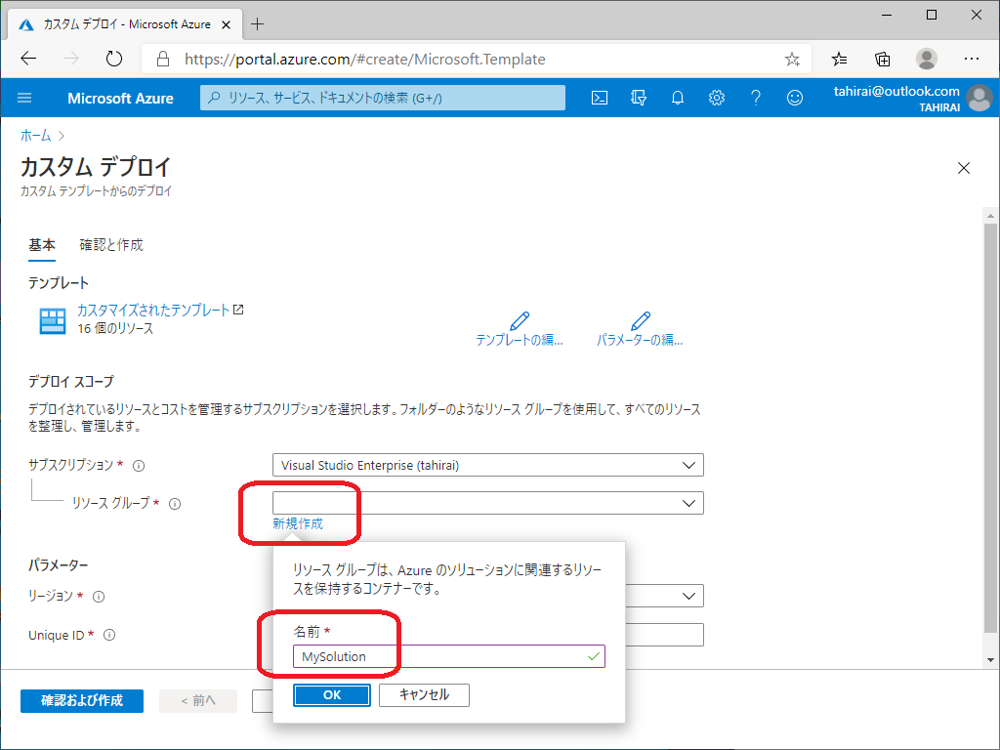
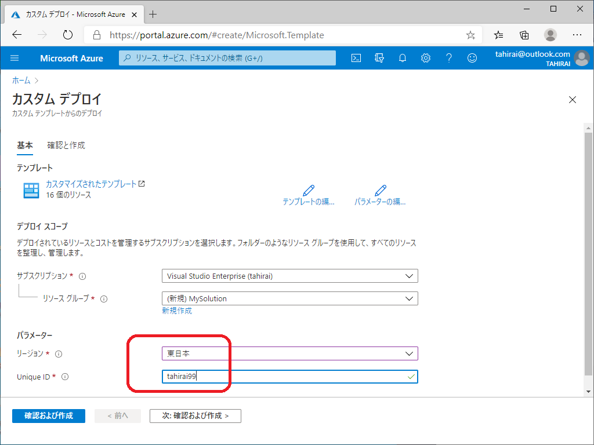
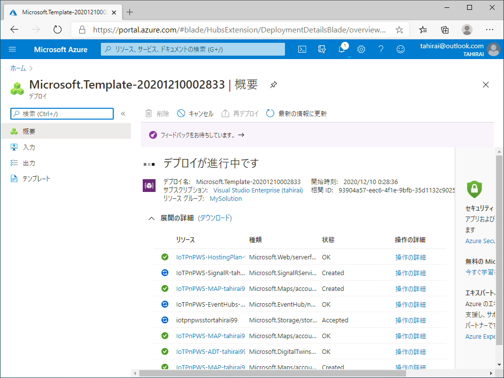
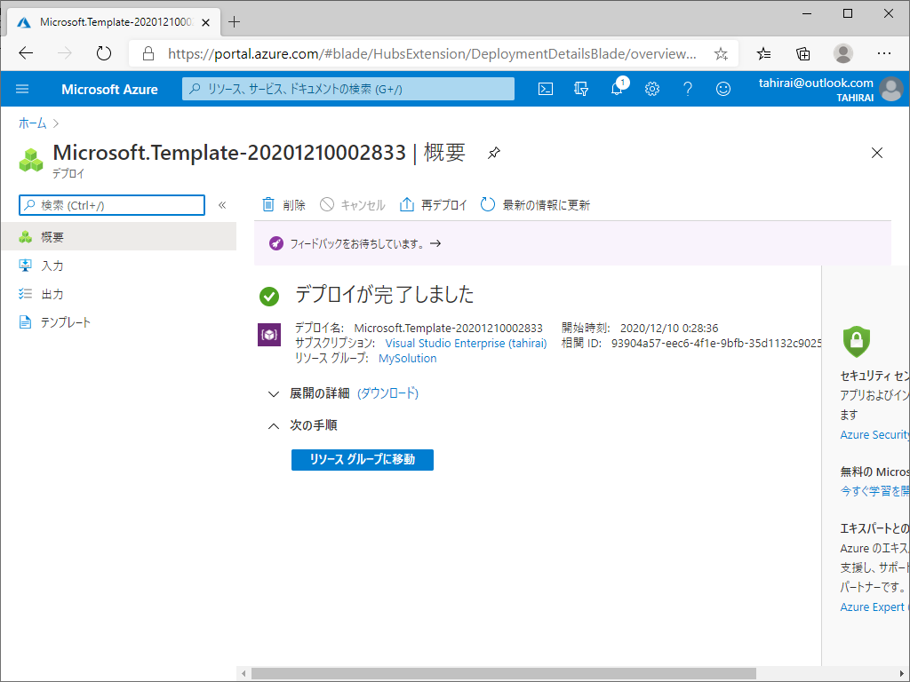
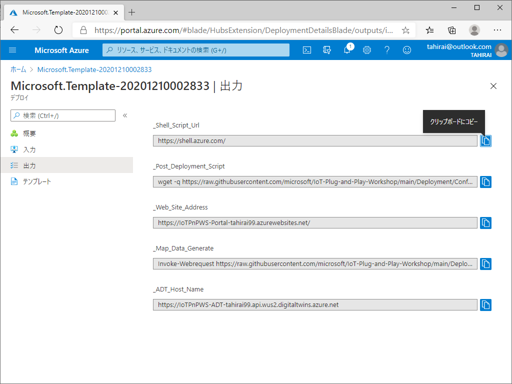
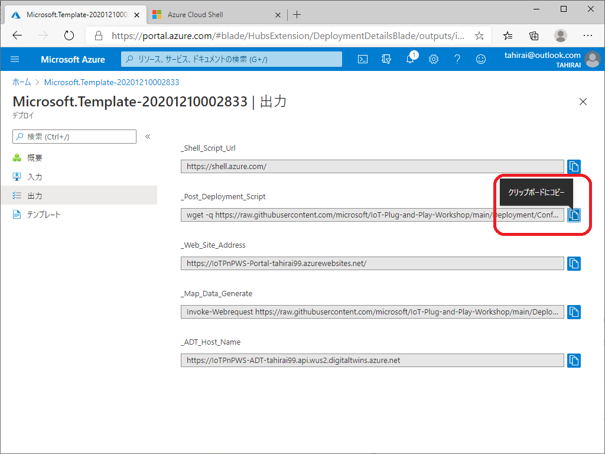
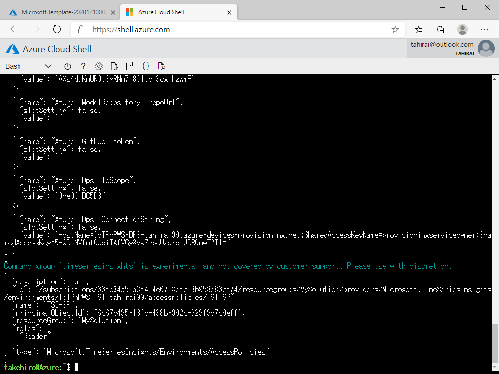

# サンプル IoT ソリューションを デプロイする

このドキュメントでは、ハンズオンで用いる サンプル IoT ソリューション のデプロイについて説明します  
大きく分けて2つのステップがあります  

1. Azure Resource Manager (ARM) テンプレートで 18 (!) 個の Azure サービスをデプロイし、設定する  
1. 展開後にスクリプトを実行して、サービス間のアクセス許可を構成する

## 必須
- Azure サブスクリプション  
    もし Azure Subscription をお持ちでない場合には、無償で作成が可能です (1年間有効)  
    <https://azure.microsoft.com/free/>  
- ウェブブラウザ (Microsoft Edge など) がインストールされた PC  

## 1. デプロイを開始する  
以下の **Deploy to Azure** ボタンをクリックします  

> [!TIP]  
> (この文章を参照し続けるため) ボタンを右クリックして **リンクを新しいタブで開く** または **リンクを新しいウィンドウで開く** とするのを推奨します

## 2. 新しいリソースグループを作成する
リソースグループとは、個々の Azure ソリューション に関連するリソースを保持するためのコンテナーです  
ファイルやフォルダに似ています

1. **サブスクリプション** を選択します (もし1つ以上お持ちの場合)  
1. **新規作成** をクリックして新しい リソースグループ を作成します  
    例: **MySolution** と入力し、**OK** をクリックします  
      

1. (お住まいの地域に近い) **リージョン** を選択します  
    > [!NOTE]  
    > サービスの展開地域の関係にて、一部のサービスはここで指定した以外のリージョンに展開されます  

1. **Unique ID** を記入します
    いくつかのサービスがグローバルな Unique ID を必要としています  
    このテンプレートはリソースを IoTPnP-WS-**\<Unique ID\>** という名前で作成します  
    ルール : 
    - 最小5文字  
    - 最大10文字  
    - アルファベット文字のみ (特殊記号文字はサポート外)  

    > [!TIP]  
    > 名前と命名規則の重複を避けるため、名前と数字の組み合わせを用いることを推奨します  
    > 例: tahirai123  
      

1. **確認および作成** をクリックします  

1. 画面をスクロールして設定内容を確認後 **作成** をクリック、デプロイを開始します  
      

1. デプロイが完了するのを待ちます(大体15分ほどかかります)  
    

1. デプロイが完了したのを確認します  
    

## 3. デプロイ後の作業を行う

一部のサービスが ARM テンプレートではカバー出来ない権限など、追加設定を追加の設定を必要としています  
**Cloud Shell** でスクリプトを実行して作業を完了します  

> [!NOTE]  
> Azure Cloud Shell は Azure リソースの管理に用いる、対話型、認証済みなブラウザーアクセス可能なシェルです  
> Bash または PowerShell のいずれか、作業方法に最適なシェルエクスペリエンスを柔軟に選択出来ます

1. **出力** をクリックします  
    3つの出力が確認出来ます  
    1. **Cloud Shell** へのリンク (*_Shell_Script_Url*)
    1. デプロイ後に実行するコマンド (*_Post_Deployment_Script*)
    1. WEB アプリケーション へのリンク (*_Web_Site_Address*)
    

1. **Cloud Shell** を開きます  
    新しいブラウザタブ、またはウィンドウを開き、<https://shell.azure.com> に移動します

    > [!TIP]  
    > **Cloud Shell** を利用したことが無かった場合、ストレージを作成するよう指示されます

1. *Bash* Shell を利用していることを確認してください  
    もしそうでない場合には *Bash* に切り替えてください  
    

1. Azure ポータルのウィンドウに戻り、*デプロイ後に実行するコマンド* の青いボタンをクリックし、項目をコピーします  
    

1. 再び **Cloud Shell** に移動してコマンドを貼り付け、Enter キーを押してスクリプトを実行します  
    

> [!NOTE]  
> スクリプト実行が完了したら、**Cloud Shell** を閉じて大丈夫です

1. Azure ポータルのウィンドウに戻り、*WEB アプリケーション へのリンク* の青いボタンをクリック、項目をコピーします  

1. サンプルアプリケーションの WEB ポータルを開き、動作を確認します  
    新しいウィンドウ、またはタブを開き、上記のリンクを貼り付けます  
    

## サンプル IoT ソリューション ポータル について

このポータル WEB アプリは 5つのメインセクションを持ちます  

- IoT Hub  
    IoT Hub と対話して、IoT デバイスの追加、削除、及び接続文字列を表示します  
- Device Provisioning Service  
    DPS と会話して、個々の登録の作成、削除、及びプロビジョニング用の対称鍵を表示します  
- Telemetry and Event  
    テレメトリーやイベントペイロードを表示します  
- Time Series Insights  
    接続されたデバイスが IoT Plug and Play に対応している場合、WEB アプリは Model ID を解決し、テレメトリーデータをライングラフとして表示します  
- Azure Map  
    Azure Digital Twins 実装の確認として、インドアマップ を表示します  

