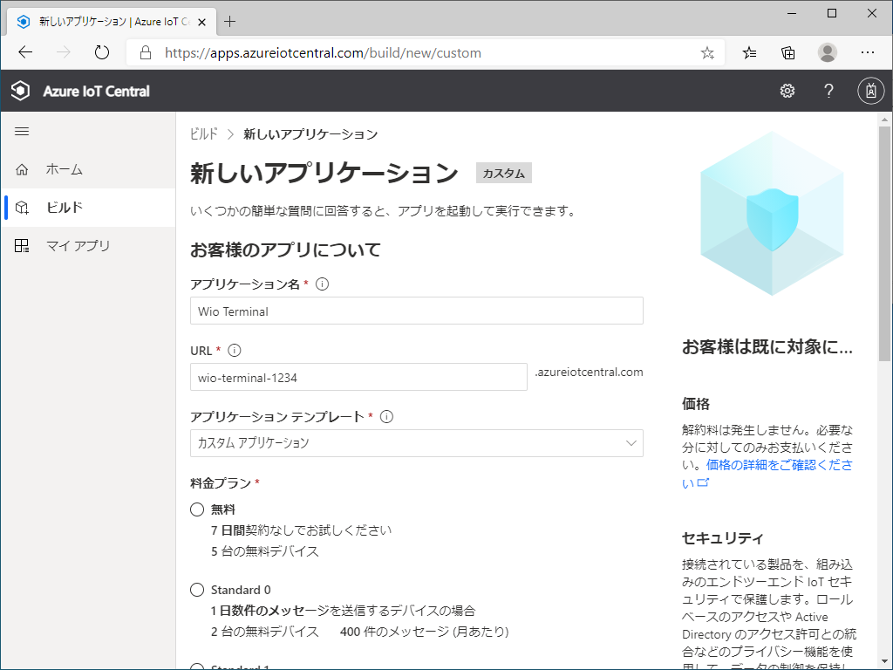
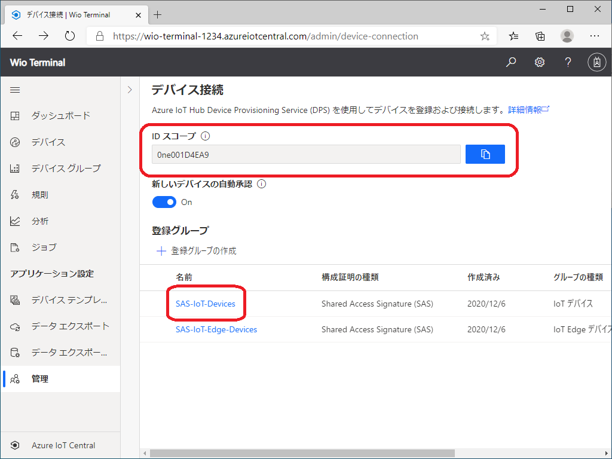
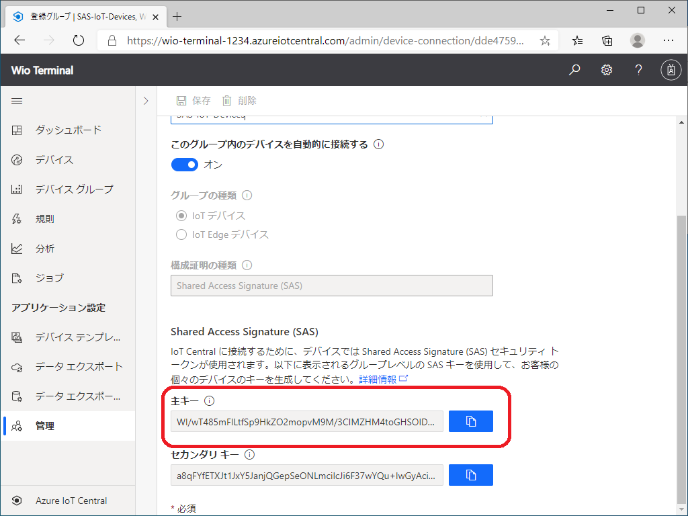
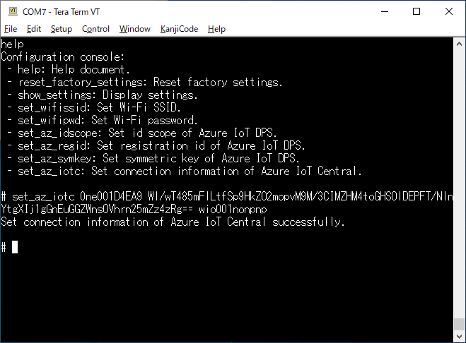
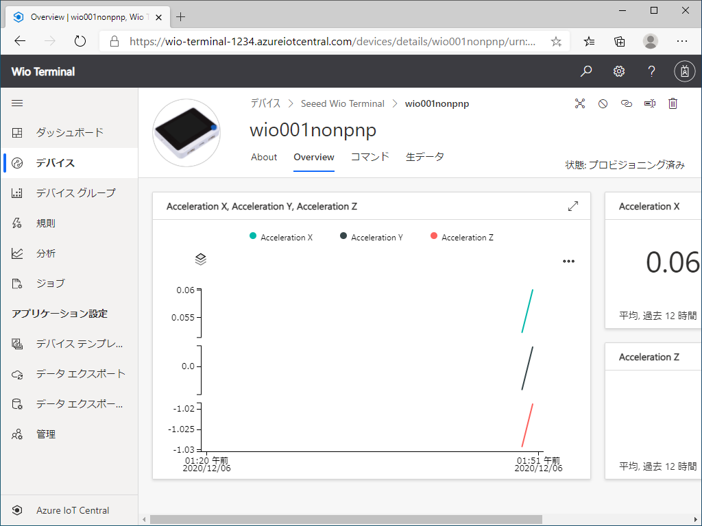
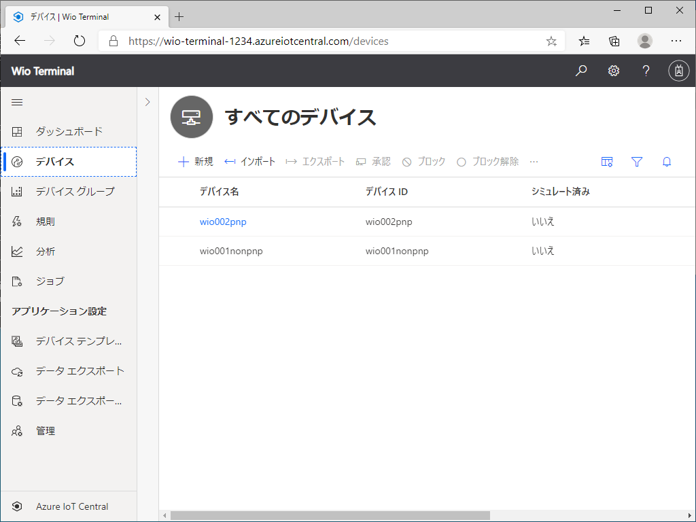

# Wio Terminal と Azure IoT Central で IoT Plug and Play を体験する

このハンズオンラボでは、以下のことを体験します :

- Azure IoT Central でアプリケーションを作成  
- Wio Terminal + IoT PnP 無しで Azure IoT Central に接続する  
- Wio Terminal + IoT PnP で Azure IoT Central に接続する  

想定時間は30分から45分です  

## ステップ 1 : 必須

- Azure サブスクリプション  
  もし Azure Subscription をお持ちでない場合には、無償で作成が可能です (1年間有効)  
  <https://azure.microsoft.com/free/>  
- Windows 10 搭載 PC  
  - WEB ブラウザ (Microsoft Edge など)  
    <https://www.microsoft.com/ja-jp/edge>
  - Tera Term (Wio Terminal とのシリアル接続時に利用します)  
    <https://ja.osdn.net/projects/ttssh2/>

## ステップ 2: Azure IoT Central でアプリケーションを作成する

まずは Azure IoT Central のアプリケーションインスタンスを作成します。

1. 以下の URL をクリックして Azure IoT Central を開きます  
    <https://apps.azureiotcentral.com/>

1. 画面をスクロールさせ **カスタムアプリを作成する** をクリックします  
  
    いくつかの項目を入力する必要がありますので、以下を参考にしてください  
    - アプリケーション名 : Wio Terminal  
    - URL : wio-terminal-1234  
      (Azure IoT Central 全体で一意である必要があります)  
    - アプリケーション テンプレート : カスタムアプリケーション  
    - 料金プラン : Standard 2  
    - ディレクトリ : (複数見える場合は、今回用いるサブスクリプションが含まれるもの)  
    - Azure サブスクリプション : (今回用いるもの)
    - 場所 : 日本  

    上記項目を入力後、**作成** をクリックすると、アプリケーションがプロビジョニングされます  

      

## ステップ 3: Wio Terminal の Wi-Fi 接続を設定する  

Wio Terminal を Configuration Mode (設定モード) で起動して、WiFi および Azure IoT Central への接続情報を設定します。 

> [!NOTE]  
> Wio Terminal ご購入直後は、まず Wi-Fi のファームウェア更新が必要です  
> その具体的な手順については、以下の URL を参照してください  
> <https://wiki.seeedstudio.com/Wio-Terminal-Network-Overview/#update-the-wireless-core-firmware>  
> 今回は、出荷前に 2.0.3 JP を適用済みですので、手順スキップ可能です

1. Wio Terminal の本体上部にある3つのボタンを押さえながら、PC に接続します  
  成功すると LCD に *In configuration mode* と表示されます  

1. デバイスマネージャで Wio Terminal の COM ポートを確認します

    この画面の場合は *USB シリアルデバイス (COM7)* がそれです

    

1. Tera Term を実行し、**Serial** をクリック、先ほど確認した COM ポートを選択、**OK** をクリックします

    

1. *help* とタイプし、設定メニューを表示します  
1. Wi-Fi SSID と パスワードを入力します  

    ```bash
    *set_wifissid (設定したいSSID)*  
    *set_wifipwd (設定したいパスワード)*
    ```

    この後もう一度このターミナルを使いますので、開いたままにします  

      

## ステップ 4: Azure IoT Central アプリケーションからデバイス接続情報を入手する

デバイスを Azure IoT Central に接続するための認証情報（キー）を入手し、Wio Terminal に設定します。

1. 左メニューの **管理** - **デバイス接続** をクリックします  

    表示される *ID スコープ* をメモ帳などに控えます  

    > [!TIPS]  
    > 値の右の青いボタンをクリックするとコピーされます  

    

1. **SAS-IoT-Devices** をクリックします  

    表示される *主キー* をメモ帳などに控えます  

    > [!TIPS]  
    > 値の右の青いボタンをクリックするとコピーされます  

    

## ステップ 5: Wio Terminal に Azure IoT Central 接続設定を書き込む

TeraTerm の画面に戻って Azure IoT Central の接続情報を書き込みます

```bash
set_az_iotc (スコープID) (主キー) (デバイスID)
```

> [!TIPS]  
> デバイスIDは一意である必要があります (例: *wio001nonpnp* など)  
  

書き込み後、TeraTerm を閉じます  

## ステップ 6: Wio Terminal に Non-PnP 版のファームウェアを書き込む

まず初めに IoT Plug and Play 非対応のファームウェアを使用して Azure IoT Central に接続します。

1. Wio Terminal を アプリケーション書き込みモード で起動します  

    Wio Terminal の本体左部にあるスライドスイッチを素早く2回下げます  
    成功すると、PC のエクスプローラに *Arduino* という名前のドライブが表示されます  
    

1. *Arduino* ドライブに *uf2* フォルダ内の *NonPnP.uf2* をドラッグ＆ドロップします  
書き込みに成功すると、Wio Terminal が自動的に再起動、アプリケーションが開始します  

## ステップ 7: Azure IoT Central でデバイス登録を確認する

左メニューの **デバイス** をクリックします

Wio Terminal が Azure IoT Central 内の DPS を通じてデバイス登録されているのが確認出来ます  
テレメトリーも Azure IoT Central に流れてきていますが、Azure IoT Central はどのようなデータが流れてきているか理解出来ないため、可視化等を行うことが出来ません  
この状態が、IoT Plug and Play の無い世界における一般的な状況です  

  

### EXTRA-1. デバイステンプレートを作成して可視化する

先ほどご覧いただいた動画にもあった通り、デバイステンプレートを手動にて作成いただければ、可視化等を行うことが出来ます  
ご興味あれば、お試しください  



## ステップ 8: IoT Plug and Play 対応デバイスとして接続

IoT Plug and Play 対応デバイスとして Azure IoT Central に接続するために以下の２つの作業を行います。

- 別デバイスとして接続するために、Wio Terminal の設定を変更する
- IoT Plug and Play 対応ファームウェアに更新する

### Wio Terminal の設定を変更

1. Wio Terminal の本体上部にある3つのボタンを押さえながら、PC に接続します  
1. TeraTerm で Azure IoT Central の接続情報を書き込みます  

    ```bash
    set_az_iotc (スコープID) (主キー) (デバイスID)
    ```

    書き込み後、TeraTerm を閉じます  
    > [!TIPS]  
    > デバイスIDは先ほどと違うものを指定します (例: *wio002pnp* など)  

    

### Wio Terminal に IoT Plug and Play 対応ファームウェアに更新

1. Wio Terminal を アプリケーション書き込みモード で起動します  

1. Wio Terminal の本体左部にあるスライドスイッチを素早く2回下げます  

    成功すると、PC のエクスプローラに *Arduino* という名前のドライブが表示されます  

1. *Arduino* ドライブに *uf2* フォルダ内の *PnP.uf2* をドラッグ＆ドロップします  

    書き込みに成功すると、Wio Terminal が自動的に再起動、アプリケーションが開始します

## ステップ 9: Azure IoT Central でデバイス登録を確認する

1. 左メニューの **デバイス** をクリックします  

    Wio Terminal が Azure IoT Central 内の DPS を通じてデバイス登録されているのが確認出来ます  
    ただし、先ほどと異なり*デバイス名*がクリック出来ます(デバイステンプレートが自動で適用されています)  

      

1. *デバイス名* (画面では *wio002pnp*) をクリックします  

    テレメトリーを受け取り、可視化が始まっているのが確認できます  
    これが IoT Plug and Play と IoT Plug and Play に対応した Azure IoT Central が実現する世界です  

    

## 参考資料

- Azure Certified Device Catalog : <https://devicecatalog.azure.com/>  
- Wio Terminal / Azure Certified Device Catalog :  <https://devicecatalog.azure.com/devices/8b9c5072-68fd-4fc3-8e5f-5b15e3a20bd9>  
- Seeed Wio Terminal : <https://www.seeedstudio.com/Wio-Terminal-p-4509.html>  
- Seeed Japan / wioterminal-aziot-example : <https://github.com/SeeedJP/wioterminal-aziot-example/releases>  
- Azure IoT Central : <https://aka.ms/iotcentral>  

***

[ワークショップ トップページに戻ります](../)  
